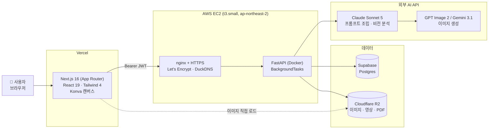
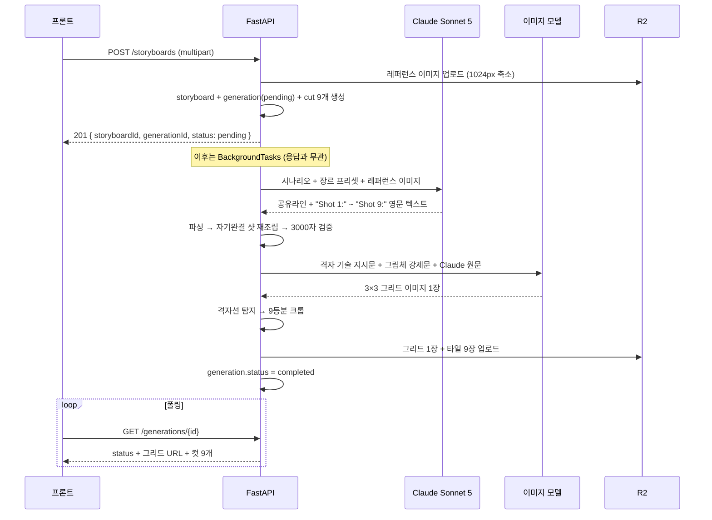
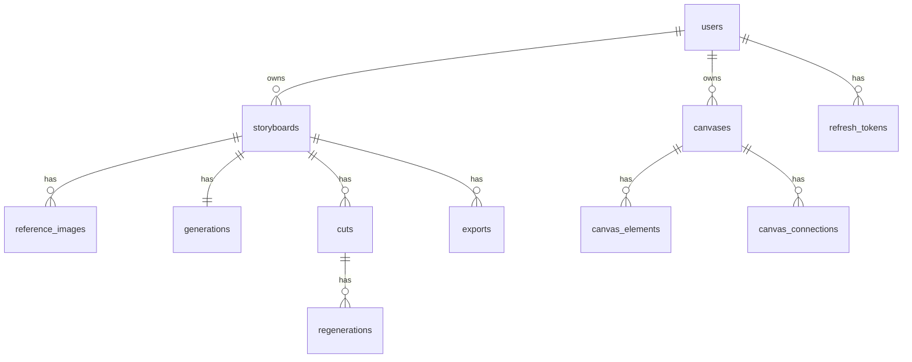

<div align="center">


# 🎬 GeNova

**시나리오 한 문단으로, 스토리보드 한 장까지**

_A scenario paragraph in, a 9-panel storyboard and a video-ready prompt out._

기획 텍스트와 영상 제작 사이의 빈 칸을 메우는 도구 : 시나리오를 넣으면 **3×3 그리드 스토리보드 1장**과 **영상 AI에 그대로 넣는 영문 프롬프트**가 함께 나옵니다.

<br/>

[](https://frontend-kxb-2.vercel.app)
[](https://github.com/kxb2/frontend)
[](https://github.com/kxb2/backend)

`Next.js 16` · `React 19` · `FastAPI` · `Claude Sonnet 5` · `GPT Image 2` · `Gemini 3.1` · `Supabase` · `Cloudflare R2` · `AWS EC2` · `Vercel`

</div>

---

> [!IMPORTANT]
> **이 문서는 인수인계 문서입니다.**
> 이 프로젝트는 2026년 6월 23일 ~ 7월 29일, 6명이 약 1개월(1인 주 15시간) 동안 만든 MVP이며 **개발 종료와 함께 담당자 전원이 이탈**합니다.
> 원 담당자에게 물어볼 수 없는 상태를 전제로, **코드만 봐서는 알 수 없는 것**(설계 배경 · 주의가 필요한 지점 · 후속 작업 방향)을 남기는 것이 이 문서의 목적입니다.
>
> **읽는 순서 제안**
> - 처음 인계받았다 → `1. 30초 요약` → `4. 코드 지도` → `7. 알려진 이슈` → `8. 인수인계 체크리스트`
> - 당장 돌려봐야 한다 → `6. 로컬 실행 · 환경변수` → `8. 인수인계 체크리스트`(⚠️ 자산 소유 현황부터)
> - 이걸로 뭘 더 할지 정해야 한다 → `1. 30초 요약` → `9. 앞으로의 활용 제안`

---

## 목차

| # | 항목 | 한 줄 |
|---|---|---|
| 1 | [30초 요약](#1-30초-요약) | 뭘 만들었나 |
| 2 | [시스템 아키텍처](#2-시스템-아키텍처) | 뭐가 뭐랑 붙어있나 |
| 3 | [생성 파이프라인 해부](#3-생성-파이프라인-해부) | **이 서비스의 심장** |
| 4 | [코드 지도](#4-코드-지도) | 어디를 고치면 뭐가 바뀌나 |
| 5 | [데이터 모델](#5-데이터-모델) | DB와 스토리지에 뭐가 쌓이나 |
| 6 | [로컬 실행 · 환경변수](#6-로컬-실행--환경변수) | 돌려보는 법 |
| 7 | [알려진 이슈 및 기술 부채](#7-알려진-이슈-및-기술-부채) | **인계 전 반드시 확인** |
| 8 | [인수인계 체크리스트](#8-인수인계-체크리스트) | 넘겨받아야 할 것 |
| 9 | [앞으로의 활용 제안](#9-앞으로의-활용-제안) | **이걸로 뭘 할 수 있나** |
| 10 | [부속 문서 색인](#10-부속-문서-색인) | 더 깊이 볼 곳 |

---

## 1. 30초 요약

### 무엇을 푸는가

방송·영상 제작에서 **기획(텍스트)** 과 **영상 생성 AI** 사이에는 "콘티를 짜고, 컷마다 프롬프트를 영문으로 쓰는" 수작업 구간이 있습니다. GeNova는 이 구간을 자동화합니다.

```
기획(텍스트)  →  [ GeNova ]  →  영상 AI  →  합치기 · 음악 · 자막
                     ↓
        3×3 그리드 스토리보드 1장
        + 통합 영문 프롬프트 1블록
```

> 사내 A/B/C 3개 라인 중 **B라인**이 이 프로젝트입니다. A라인 = 영상 생성, C라인 = 효과음·자막. 최종 목표는 3개를 하나의 플랫폼으로 합치는 것이며, GeNova는 그중 "기획 → 콘티" 단계 산출물만 담당합니다.

### 사용자가 하는 일

1. **로그인** (이메일 가입 / 구글)
2. **시나리오 입력 + 분위기(장르) 선택** — 여기까지가 필수 입력의 전부
3. (선택) 고급 설정 — 이미지 모델 2종 · 그림체 3종 / 참고 이미지 최대 10장
4. **생성** → 3×3 그리드 이미지 1장 + Shot 1~9로 나뉜 영문 프롬프트
5. **내보내기** — PDF(공유용) 또는 이미지(영상 AI 투입용)
6. **캔버스** — 레퍼런스·결과물·메모를 자유롭게 배치하는 별도 보드

### 설계상 가장 중요한 결정 3가지

| 결정 | 왜 |
|---|---|
| **산출 단위 = 이미지 1장** (컷 9개가 아니라) | 이미지 모델 호출 1회로 9컷을 한 화면에 그리면 **인물·의상·공간 일관성**이 압도적으로 유리. 컷별 생성은 컷마다 사람이 달라짐 |
| **레퍼런스 이미지는 이미지 모델에 안 들어감** | Claude가 비전 분석해 **텍스트로 변환**한 것만 전달. 이미지 모델 입력을 텍스트로 통일해 **모델 교체 비용을 0에 가깝게** 유지 |
| **캔버스는 스토리보드에 종속되지 않음** | 생성 파이프라인의 단계가 아니라 독립 보드. 캔버스가 망가져도 생성·Export는 그대로 동작 |

---

## 2. 시스템 아키텍처



| 층 | 선택 | 이유 |
|---|---|---|
| 프론트 배포 | **Vercel** | Next.js 기본 조합 |
| 백엔드 배포 | **AWS EC2 + Docker + GitHub Actions** | 사내 AWS 크레딧 활용 · 전 개발자의 배포 스크립트 재사용 |
| 도메인 | **DuckDNS** (`kxb2-backend.duckdns.org`) | 무료 고정 도메인 + Let's Encrypt HTTPS |
| DB | **Supabase(Postgres)** | 스토리보드–컷–캔버스–Export의 관계형 구조에 적합 |
| 스토리지 | **Cloudflare R2** | **대역폭 무료** — 이미지 위주 서비스라 S3 대비 비용 유리 |
| 비동기 처리 | **FastAPI BackgroundTasks** | 생성이 1~2분 걸려 요청-응답 안에서 못 끝냄. Celery/Redis는 1인 60시간 규모 MVP에 과함 |

---

## 3. 생성 파이프라인 해부

**이 프로젝트에서 가장 밀도 높은 코드**입니다. 백엔드의 나머지는 대체로 평범한 CRUD이고, 남는 덩어리는 프론트의 캔버스(§4.2)입니다.

### 3.1 전체 흐름



### 3.2 2단계 구조 — 왜 Claude를 한 번 거치는가

| 단계 | 주체 | 입력 | 출력 |
|---|---|---|---|
| 1 | **Claude Sonnet 5** | 한국어 시나리오 + 장르 프리셋 + 레퍼런스 이미지(0~10장) | 영문 이미지 생성 프롬프트 |
| 2 | **GPT Image 2 / Gemini 3.1** | 1단계 산출 **텍스트만** | 그리드 이미지 1장 |

**레퍼런스 이미지는 2단계로 전달되지 않습니다.** Claude가 인물 외형·의상·공간·조명·색감을 텍스트로 추출하고, 그 텍스트만 이미지 모델로 갑니다.

- 👍 이미지 모델 입력이 100% 텍스트라 **API 키와 모델 문자열만 바꾸면 모델 교체 완료**
- 👎 이미지→텍스트를 경유하므로 **외형의 정확한 재현은 불가** — 레퍼런스는 "분위기·구도·스타일 참조" 수준

> ⚠️ 기획 단계에서는 이 한계를 첨부 영역에 사전 고지하기로 했지만(① 이미지는 Claude가 분석해 프롬프트에 반영하며 외형 정확 재현이 아님 ② 실존 인물 사진은 분석이 거부될 수 있음), **실제 UI에는 들어가지 않았습니다.** 첨부 영역의 사용자 노출 문구는 이게 전부입니다:
> ```
> 참고 이미지 (선택)
> 텍스트로도 생성할 수 있지만, 참고 이미지를 넣으면 퀄리티가 훨씬 좋아져요.
> 이미지를 끌어다 놓거나 클릭해서 추가
> 캐릭터, 배경, 소품 등 · 최대 10장
> ```
> 한계 고지가 없을 뿐 아니라 **"캐릭터"를 예시로 들고 "퀄리티가 좋아진다"고 해서 오히려 외형 재현을 기대하게 만드는 문구**입니다. 실존 인물 사진을 넣었다가 Claude 단계에서 거부되면 사용자는 이유를 알 수 없습니다(§7-12).

### 3.3 프롬프트가 3겹으로 나뉘는 이유 ⭐

`app/ai/onegrid_prompt_adapter.py`의 핵심 아이디어입니다. **Claude가 쓴 텍스트는 그대로 두고, 용도별로 다른 것을 앞뒤에 붙입니다.**

```
[Claude 원문]                    ← 공유라인(로케이션; 조명/스타일; 인물 고정구) + Shot 1~9

  ├─▶ 이미지 모델로 갈 때
  │    GRID_TECHNICAL_PREAMBLE  ← "3×3, 헤어라인 구분선 1~2px, 패널 번호 절대 넣지 말 것"
  │    + ART_STYLE_ENFORCEMENT  ← "9칸 전부 실사/3D/일본 애니로"
  │    + Claude 원문
  │
  └─▶ 사용자에게 보여줄 통합 프롬프트로 갈 때
       Shot N + 조명/스타일 문구 + 그림체 영문 태그  ← 자기완결적으로 재조립
```

**왜 이렇게 나눴나:**

- 통합 프롬프트는 사용자가 **Seedance에 그대로 복사해 붙이는 산출물**입니다. 여기에 "3×3 격자로 그려라" 같은 이미지 생성용 지시가 섞이면 안 됩니다
- 반대로 이미지 모델에는 격자 지시가 반드시 필요합니다
- 그림체는 **Claude에게 맡기지 않고 사용자가 고른 값을 백엔드가 강제**합니다 (`2D 애니메이션` → 내부적으로 `japanese anime`. 안 그러면 미국 카툰풍과 섞임)
- 재조립 시 **로케이션은 제외하고 조명/스타일만** 각 샷에 붙입니다. 로케이션은 컷마다 다를 수 있어서 전 컷에 반복하면 본문과 충돌하기 때문입니다

### 3.4 격자선 탐지 크롭 ⭐

그리드 이미지 1장을 컷 9장으로 쪼개야 하는데, **정확히 1/3, 2/3 지점을 자르면 안 됩니다.** 이미지 모델이 픽셀 단위로 균일하게 그려주지 않기 때문입니다.

`onegrid_service.py`의 `_crop_into_tiles()`가 하는 일:

1. 이미지를 흑백으로 변환
2. 1/3, 2/3 지점 **주변 ±15% 구간만** 밝기 평균을 스캔 (전체를 훑지 않아 빠르고, 패널 안쪽의 어두운 소품을 오탐하지 않음)
3. 그 구간에서 **가장 어두운 열/행** = 실제 구분선으로 판정
4. 단, 대비가 표준편차보다 작으면 "뚜렷한 선을 못 찾음"으로 보고 **균일 1/3 지점으로 폴백** — 애매한 신호를 억지로 확정하지 않음

> ⚠️ `window_ratio`(기본 0.15)는 반드시 **1/6 미만**이어야 합니다. 두 탐색 구간이 겹치면 엉뚱한 경계선을 줍게 되며, 코드에 `assert`가 걸려 있습니다.

### 3.5 재시도 · 실패 처리

**백엔드 자동 재시도 (사용자에게 안 보임)**

| 구간 | 트리거 | 총 시도 | 상수 |
|---|---|---|---|
| 이미지 생성 | 타임아웃 / 429 / 5xx | 3회 | `generate_image(max_retries=2)` |
| 프롬프트 생성 | 형식 불일치 / 3000자 초과 **+ Claude API 오류 전반** | 3회 | `MAX_ONEGRID_PROMPT_ATTEMPTS` |
| 크롭 후 R2 업로드 | 업로드 에러 | 2회 | `_CROP_UPLOAD_MAX_ATTEMPTS` |
| R2 다운로드 | 타임아웃 / 429 / 5xx | 3회 | `MAX_DOWNLOAD_RETRIES` |

> 상수마다 **"재시도 횟수"와 "총 시도 횟수" 의미가 섞여 있습니다**(`max_retries=2`는 최초 1회 + 재시도 2회 = 총 3회, `MAX_ATTEMPTS=3`은 그 자체가 총 3회). 위 표는 **총 시도 횟수로 통일**해서 적었습니다. 값을 조정할 때는 상수 이름을 먼저 확인하세요.
>
> - **이미지 생성**이 다른 구간보다 넉넉한 이유 — 컷별 격리가 없는 구조라 한 번 실패하면 9컷 전부 실패입니다
> - **업로드 자체에는 재시도가 없습니다** — `upload_image_bytes()`는 실패 시 즉시 `503`을 던지고, 위 표의 "크롭 후 R2 업로드 2회"는 **크롭+업로드 묶음을 다시 도는 바깥 루프**입니다
> - 프롬프트 생성은 **바깥 루프가 3회**이고 Claude 어댑터 내부는 `max_retries=0`이라, Claude 호출 총량도 3회입니다

재시도는 지수 백오프 + jitter이며, **재시도해도 소용없는 에러는 재시도하지 않는다**는 것이 원칙입니다:

```
# app/ai/retry.py — call_with_retry() 기준
AIAdapterTimeoutError      → 재시도 O
AIAdapterUnavailableError  → 재시도 O   (429/500/502/503/504/529)
AIAdapterRequestError      → 재시도 X   (400/401 — 콘텐츠 정책 거부 포함)
```

각 SDK(OpenAI / google-genai / anthropic)의 고유 예외를 `app/ai/exceptions.py`의 **공통 타입으로 정규화**해서, 재시도 로직이 SDK를 몰라도 되게 만들어 두었습니다.

> ⚠️ **위 원칙은 이미지 생성 단계에서만 지켜집니다.** 프롬프트 생성 단계는 `except (AIAdapterError, PromptValidationError)`로 잡는데, **`AIAdapterRequestError`가 `AIAdapterError`의 하위 타입**이라 정책 거부(400)까지 함께 걸려 **3회 전부 재시도합니다.**
> ```python
> # onegrid_service.py — _generate_onegrid_prompt()
> except (AIAdapterError, PromptValidationError) as exc:   # ← RequestError도 여기 걸림
> ```
> 결과가 틀리지는 않습니다(3회 모두 실패 후 같은 안내가 나감). 다만 **거부가 확정된 요청에 Claude 호출을 3배로 쓰고, 사용자 대기 시간도 3배**가 됩니다. 액션·스릴러 시나리오에서 정책 거부가 잦다는 점을 감안하면 실제 비용에 영향이 있습니다.
> → 고치려면 `except (AIAdapterTimeoutError, AIAdapterUnavailableError, PromptValidationError)`로 좁히면 됩니다.

**사용자에게 보이는 동작**

- 실패 시 **입력값 그대로 재생성 버튼** 제공 (자동 재생성 아님 — 의도적으로 하지 않기로 결정)
- 에러 메시지는 반드시 `user_facing_error_message()`를 거칩니다. Anthropic/OpenAI 원본 에러 텍스트가 사용자 화면에 노출되면 안 되기 때문입니다

> **알려진 한계**: 400 계열이 "콘텐츠 정책 거부"인지 "우리 코드가 잘못 보낸 요청"인지 **구분하지 않습니다.** 제공자별 에러 바디를 파싱해야 하는데 시간이 없어 `"시나리오 내용을 순화하거나 잠시 후 다시 시도해 주세요"`라는 **양쪽 다 커버되는 문구**로 처리했습니다. 실사용에서 마주치는 400은 대부분 액션·스릴러 시나리오의 정책 거부입니다.

### 3.6 3000자 제약

다운스트림 Seedance 2.0의 입력 한계가 3000자입니다. 검증 대상은 **재조립된 최종 통합 프롬프트**입니다.

Claude가 매번 여유 있게 써도, 조명/스타일 문구가 9번 반복되므로 **여기서 1자는 최종 9자**가 됩니다. 그래서 Claude 프롬프트를 건드리는 대신 조명/스타일을 **100자에서 단어 경계로 자르는** 방식으로 상한을 걸었습니다.

---

## 4. 코드 지도

### 4.1 백엔드 — `github.com/kxb2/backend`

FastAPI. **도메인마다 `models / schemas / service / router` 4파일**로 끊는 규칙이 일관되게 지켜져 있습니다. 새 기능을 붙일 때도 이 패턴을 따르면 됩니다.

```
app/
├── main.py              앱 조립 · lifespan(임시 마이그레이션 · 좀비 job 복구) · 전역 예외 핸들러
│
├── ai/                  ⭐ 외부 AI를 갈아끼울 수 있게 하는 층
│   ├── base.py                  PromptAdapter / ImageAdapter 추상 클래스
│   ├── prompt_adapter.py        Claude — 9컷 개별 생성용(레거시)
│   │                            ⚠️ 단, GENRE_PRESETS·_map_error는 현행 경로가 import함 (삭제 금지)
│   ├── onegrid_prompt_adapter.py  Claude — 그리드 1장용 ⭐ 시스템 프롬프트 전문이 여기
│   ├── image_adapter.py         GPT Image / Gemini + 화면비 변환 + SDK 예외 정규화
│   ├── exceptions.py            재시도 가능/불가 예외 타입
│   └── retry.py                 지수 백오프 + jitter
│
├── storyboards/         스토리보드 CRUD · 레퍼런스 업로드 · 생성/Export 진입점
├── generations/
│   ├── service.py               per_cut 경로 (9컷 병렬 생성 → 서버 합성) — 레거시
│   └── onegrid_service.py       ⭐ single_image 경로 (현행). 격자 크롭이 여기
├── regenerations/       ※ 폐지된 컷별 재생성 — 현재 미사용(§7-5)
├── canvases/            캔버스 조회/저장/첨부 업로드
├── exports/             PDF / 이미지 Export (reportlab · zipfile)
├── users/               이메일 가입 · 구글 로그인 · JWT · refresh 로테이션
├── core/
│   ├── config.py                pydantic-settings (JWT 시크릿 32자 미만이면 기동 거부)
│   ├── enums.py                 JobStatus · ImageModel · GenerationMode · ArtStyle · Genre
│   ├── storage.py               R2 업로드/다운로드 · 이미지 검증 · 리사이즈
│   ├── security.py              비밀번호 해싱 · access token 발급
│   └── rate_limit.py            IP 기준 분당 제한 (인메모리)
└── db/                  SQLAlchemy 엔진 · 세션

test/                    pytest — 도메인별로 app/ 구조를 그대로 미러링 (test_*.py 24개)
                         + check_r2.py · manual_google_login.html (수동 확인용, 자동 테스트 아님)
```

> **테스트가 있습니다.** 크롭·프롬프트 파싱·Export·캔버스 스키마 검증처럼 **손댔을 때 조용히 깨지기 쉬운 곳**이 덮여 있습니다. 아래 §9.1의 정리 작업을 할 때 안전망으로 쓰세요.
> ```bash
> pytest                    # 전체
> pytest test/generations   # 생성 파이프라인만
> ```

**여기를 고치면 이게 바뀝니다**

| 하고 싶은 것 | 손댈 파일 |
|---|---|
| 생성 결과 품질 튜닝 | `ai/onegrid_prompt_adapter.py` — `ONEGRID_SYSTEM_PROMPT` |
| 장르 추가 / 앵글 아크 변경 | `ai/prompt_adapter.py` — `GENRE_PRESETS` + `core/enums.py` — `Genre` |
| 그림체 추가 (예: 그림책) | `core/enums.py` `ArtStyle` + `onegrid_prompt_adapter.py`의 태그 2종 + 프론트 `storyboardFields.ts` |
| 이미지 모델 교체·추가 | `ai/image_adapter.py`에 어댑터 클래스 추가 + `get_image_adapter()` 분기 |
| 컷이 깔끔하게 안 잘림 | `generations/onegrid_service.py` — `_crop_into_tiles()` |
| PDF 레이아웃 | `exports/service.py` — `_PDF_*` 상수들 |

### 4.2 프론트엔드 — `github.com/kxb2/frontend`

Next.js 16 App Router. 페이지는 3개(`/` 입력 · `/storyboard` 결과 · `/canvas`)뿐이고, **부피의 대부분은 캔버스**입니다.

> **내보내기에는 전용 페이지가 없습니다.** 초기에는 `/export` 페이지에서 클라이언트가 직접 PDF를 만들었지만(`@react-pdf/renderer`), **페이지째 제거되고 백엔드 Export API 호출로 일원화**됐습니다. 현재는 `/storyboard`의 내보내기 드롭다운 → `POST .../exports/{pdf,image}` → `GET /exports/{id}` 폴링 → 다운로드 링크를 새 탭으로 여는 흐름입니다.

```
app/
├── page.tsx                     시나리오 입력 화면
├── storyboard/                  결과 화면
│   ├── page.tsx                 폴링 · 내보내기 드롭다운 · 실패 시 전체 재생성
│   ├── ReadStoryboard.tsx       라이브러리에서 들어온 기존 스토리보드를 읽기 전용 표시
│   ├── image/
│   │   ├── imagesingle.tsx      ⭐ 현행 — 그리드 1장 표시
│   │   ├── imagegrid.tsx        ※ per_cut용 9칸 그리드 — 미사용(§7-5)
│   │   └── imagecell.tsx        ※ per_cut용 컷 셀 — imagegrid에서만 참조, 미사용
│   └── promptbox/
│       └── propmptbox.tsx       통합 프롬프트 박스 (파일명 오타가 실제 경로입니다)
│
├── auth/                        ⭐ 인증
│   ├── tokenStore.ts            accessToken=메모리, refreshToken=local/sessionStorage
│   ├── AuthContext.tsx          로그인 상태 · 세션 만료 이벤트 수신
│   ├── AuthGate.tsx             보호 경로 진입 차단
│   ├── LoginModal.tsx           이메일/구글 로그인 모달
│   ├── googleIdentity.ts        Google Identity Services (FedCM 대응)
│   └── protectedPaths.ts        로그인 필요한 경로 목록
│
├── api/
│   ├── http.ts                  ⭐ authorizedFetch — 401이면 자동 재발급 후 1회 재시도
│   ├── auth/api.ts              가입·로그인·구글·refresh·logout
│   ├── storyboard/api.ts        스토리보드·생성·Export (+ 폐지된 컷 재생성 함수 2개)
│   ├── canvas/api.ts + adapter.ts   서버 스키마 ↔ 캔버스 문서 변환
│   └── proxy/route.ts           R2 이미지 CORS 우회 (`.r2.dev` 호스트만 허용)
│
├── components/                  화면 공통
│   ├── Header.tsx               헤더 · 라이브러리 진입
│   ├── Library.tsx              좌측 슬라이드 사이드바 (스토리보드/캔버스 목록·제목수정·삭제)
│   └── FormField.tsx            입력 폼 (시나리오·장르·고급설정·파일 업로드)
│
├── data/
│   ├── storyboardFields.ts      ⭐ 입력 화면의 라벨·장르·이미지모델·그림체 정의
│   └── mockStoryboardResult.ts  ※ API 연동 전 사용하던 더미 데이터 — 미사용
│
├── utils/                       savedAt · lastSelected · syncEvents · time
├── layout.tsx  globals.css      루트 레이아웃 · 전역 스타일(컬러 토큰)
│
└── canvas/                      ⭐ Konva 캔버스 — 부피의 대부분
    ├── page.tsx                 캔버스 전환·목록·썸네일 캐싱
    └── _components/
        ├── core/       Workspace(저장·업로드 오케스트레이션) · Canvas(렌더) ·
        │               Toolbar · Minimap · Switcher · useHistory · useViewport
        ├── items/      CanvasItem · MediaItem · MemoItem · SectionItem
        ├── tools/      connector(곡선·핸들) · memo(편집·제목·리사이즈·색상) · section
        └── transform/  useSelect · useItemResize · useRotate · Overlay · math

types/                           ai · api · auth · canvas · canvasApi · input · storyboard
```

> ⚠️ `@react-pdf/renderer`가 **`package.json`에 남아 있습니다.** `/export` 페이지와 함께 쓰이던 의존성인데 폴더만 지우고 패키지는 그대로라, 지금은 어디서도 import하지 않습니다 — 정리 대상입니다.

**캔버스에서 알아둘 것**

- **자동 저장**: 변경 후 **1초 디바운스**. 저장 버튼은 없습니다
- **삭제 유예 8초**: 삭제 직후 8초간은 저장을 미룹니다. 그 사이 `Ctrl+Z`를 누르면 서버에 저장이 아예 안 나가 R2 첨부파일도 안 지워집니다
- **이탈 시 flush**: 캔버스 전환/언마운트 시 디바운스 대기 중이던 마지막 편집을 즉시 저장합니다
- **업로드 중 저장 보류**: `blob:` 미리보기가 남아 있으면 저장을 미룹니다. 실패한 아이템은 제거해서 보류가 영구화되지 않게 합니다
- **조작 규약**: 스크롤=상하 / `Shift`+스크롤=좌우 / `Ctrl`+스크롤=확대축소 / 휠 클릭 드래그=화면 이동. 핸드 툴 아이콘은 "휠 클릭 이동은 피그마·포토샵 사용자에게만 익숙한 관습"이라는 이유로 **의도적으로 남겨두었습니다**
- **이미지는 원본 크기로 배치**됩니다 (캔버스에 맞춰 축소하지 않음 — 축소하면 너무 작아지는 케이스가 있었음). 메모 폰트 크기는 "내보내기 그리드 이미지를 올렸을 때 읽히는 크기"를 기준점으로 잡았습니다

### 4.3 API 한눈에

전 엔드포인트가 `Authorization: Bearer <accessToken>` 필요 (`/auth/*`, `/health` 제외).
JSON은 camelCase, 단 `POST /storyboards`만 `multipart/form-data`라 폼 필드는 snake_case입니다.

| 그룹 | 엔드포인트 |
|---|---|
| 인증 | `POST /auth/register` `/login` `/google` `/refresh` `/logout` · `GET /auth/me` |
| 스토리보드 | `POST /storyboards` · `GET /storyboards` `/{id}` `/{id}/prompt` · `PATCH` `DELETE /{id}` |
| 생성 | `GET /generations/{id}` (폴링) |
| ~~컷 재생성~~ | ~~`POST /storyboards/{id}/cuts/{cutId}/regeneration` · `GET /regenerations/{id}`~~ — **폐지된 기능. 사용하지 마세요**(§7-5) |
| 캔버스 | `POST` `GET /canvases` · `GET` `PUT` `PATCH` `DELETE /canvases/{id}` · `POST /canvases/{id}/attachments` |
| Export | `POST /storyboards/{id}/exports/pdf` `/image` · `GET /exports/{id}` |

> **소유권 정책**: 남의 리소스에 접근하면 `403`이 아니라 **`404`** 를 돌려줍니다. 존재 여부 자체를 숨기기 위한 의도적 설계입니다.
>
> 전체 명세는 [`backend/docs/API_SPEC.md`](https://github.com/kxb2/backend/blob/main/docs/API_SPEC.md), 프론트 연동 가이드는 [`FRONTEND_USER_AUTH_GUIDE.md`](https://github.com/kxb2/backend/blob/main/docs/FRONTEND_USER_AUTH_GUIDE.md).

---

## 5. 데이터 모델



| 테이블 | 알아둘 것 |
|---|---|
| `users` | `storyboard_seq` / `canvas_seq` — **기본 제목 번호를 사용자별로** 매기기 위한 카운터 (전역 통산 아님) |
| `storyboards` | `generation_mode`(per_cut/single_image) · `style`(ArtStyle enum) · `integrated_prompt` |
| `cuts` | `order_no` 1~9 고정 · 컷별 `prompt_text`와 `image_url` |
| `generations` | 생성 job 추적. `grid_image_url`이 여기 |
| `canvas_elements` | `parent_element_id`로 섹션 그룹핑(자기참조). 저장은 **전체 교체 방식**(PUT) — 프론트가 `clientKey`로 요소를 식별해 보내면 서버가 실제 DB id로 매핑해 돌려줍니다 |

**R2에 실제로 쌓이는 것** — 보존기간 후 삭제 대상도 동일합니다.

```
레퍼런스 업로드 이미지  (긴 변 1024px로 축소 후 저장 — Claude 입력 토큰 절감)
컷별 개별 이미지 9장
그리드 이미지 1장
PDF Export 문서
이미지 Export zip     ("개별 컷 포함" 옵션을 켰을 때만 생성)
캔버스 첨부 이미지/영상/썸네일  (이미지 10MB · 영상 50MB · 캔버스당 50개 상한)
```

---

## 6. 로컬 실행 · 환경변수

### 백엔드

```bash
git clone https://github.com/kxb2/backend.git && cd backend
cp .env.example .env        # 값 채우기 (아래 표)

python -m venv .venv && source .venv/bin/activate
pip install -r requirements.txt
uvicorn app.main:app --reload --port 8080

# 또는
docker-compose up --build
```

→ Swagger UI: `http://localhost:8080/docs`

```bash
# 테스트 (개발 의존성 필요)
pip install -r requirements-dev.txt
pytest
```

### 프론트엔드

```bash
git clone https://github.com/kxb2/frontend.git && cd frontend
npm install

cat > .env.local <<'EOF'
NEXT_PUBLIC_API_URL=http://localhost:8080
NEXT_PUBLIC_GOOGLE_CLIENT_ID=<백엔드 GOOGLE_CLIENT_ID와 같은 값>
EOF

npm run dev
```

→ `http://localhost:3000`

### 환경변수

> ⚠️ **아래는 키의 "목록"입니다. 값은 이 문서에 없고, 있어서도 안 됩니다.** `8. 인수인계 체크리스트` 참고.

| 변수 | 발급처 / 비고 |
|---|---|
| `DATABASE_URL` | Supabase → Project Settings → Database (SQLAlchemy + psycopg2 형식) |
| `CORS_ALLOWED_ORIGINS` | 콤마 구분. 로컬은 `http://localhost:3000` |
| `R2_ENDPOINT_URL` `R2_ACCESS_KEY_ID` `R2_SECRET_ACCESS_KEY` `R2_BUCKET_NAME` `R2_PUBLIC_URL` | Cloudflare R2 |
| `ANTHROPIC_API_KEY` / `ANTHROPIC_MODEL` | 기본 `claude-sonnet-5` |
| `OPENAI_API_KEY` / `OPENAI_IMAGE_MODEL` / `OPENAI_IMAGE_QUALITY` | 기본 `gpt-image-2` / `medium`. quality는 `low·medium·high·auto` 외 값이면 **기동 시점에 실패** |
| `GEMINI_API_KEY` / `GEMINI_IMAGE_MODEL` | 기본 `gemini-3.1-flash-image` |
| `JWT_SECRET_KEY` | **32자 미만이면 서버가 기동하지 않습니다** (HS256 대칭키라 약한 시크릿 = 토큰 위조 위험) |
| `GOOGLE_CLIENT_ID` | Google Cloud Console |
| `NEXT_PUBLIC_API_URL` | (프론트) 백엔드 주소 |
| `NEXT_PUBLIC_GOOGLE_CLIENT_ID` | (프론트) 백엔드 `GOOGLE_CLIENT_ID`와 **반드시 같은 값** |

**소유 구분** — 위 항목 중 팀원 개인 계정에서 개설한 것은 `DATABASE_URL`(Supabase), `R2_*`(Cloudflare R2), `GOOGLE_CLIENT_ID`(Google OAuth) **3건**입니다. AI 제공사 키 3종은 회사 발급분이며, `JWT_SECRET_KEY`는 직접 생성하는 값입니다(§8).

> [!IMPORTANT]
> **GitHub Actions Secrets에는 위 항목이 포함되어 있지 않습니다.** 등록된 항목은 `EC2_HOST` · `EC2_USER` · `EC2_SSH_KEY` **3개뿐**이며, 배포 워크플로는 이 3개로 EC2에 SSH 접속해 `git pull` 및 컨테이너 재기동만 수행합니다. 키를 변경하더라도 Actions Secrets를 수정할 필요가 없습니다 — 백엔드 `.env`는 EC2 인스턴스 안에서 직접 관리합니다.

### 배포

| 대상 | 주소 | 트리거 |
|---|---|---|
| **프론트 (운영)** | https://frontend-kxb-2.vercel.app | Vercel — `main` 연동 |
| **프론트 (develop 프리뷰)** | https://frontend-git-develop-kxb-2.vercel.app | Vercel — `develop` 브랜치 자동 프리뷰 |
| **백엔드** | https://kxb2-backend.duckdns.org | `main` push → GitHub Actions(`deploy.yml`) → EC2 |

> 백엔드 주소의 `duckdns.org` 도메인과 Let's Encrypt 인증서(certbot 타이머)는 **개발 기간 중 HTTPS를 확보하기 위한 임시 조치**이며 팀원 개인 계정에서 발급했습니다. **인계 대상이 아니므로**, 재배포하실 경우 도메인과 인증서는 새로 구성하셔야 합니다(§8).

브랜치 전략: `feature/*` → PR → `develop` (자주) → PR → `main` (배포할 때만). `main`·`develop`은 PR-only 보호 룰셋이 걸려 있습니다.

> [!NOTE]
> **두 레포 모두 `develop`과 `main`이 동기화된 상태로 종료됐습니다.** 프론트는 마지막 날 **배포 4차**(`40f0fcd`)로 캔버스 개선분(메모 제목 편집 · 메모 크기 커스텀 · 휠 클릭 화면 이동 · Shift 수평 이동 · 섹션 인식 · 되돌리기 버그)과 `/export` 페이지 제거까지 운영에 반영됐고, 백엔드는 `b4164c7`이 마지막입니다.
> → **인계 시점에 따로 머지할 미반영분은 없습니다.** 운영 화면 = `main` = `develop`.

---

## 7. 알려진 이슈 및 기술 부채

> 아래 항목은 **모두 개발 기간 중 의도적으로 감수한 부채**이며, 각 항목마다 그렇게 판단한 근거를 함께 기재했습니다.
> 🔴 3건은 펼쳐 두었고, 🟡 9건은 접어 두었습니다 — **제목을 클릭하면 상세가 열립니다.**

<div align="center">

| | # | 항목 | 한 줄 |
|:--:|:--:|---|---|
| 🔴 | 1 | 키 노출 상태 | 레포엔 없지만 **이탈 인원 전원이 보유 중** |
| 🔴 | 2 | Alembic 없음 | 스키마 변경이 `main.py`에 하드코딩 |
| 🔴 | 3 | DB 공유 | **로컬 = 운영** — 로컬 테스트가 운영에 쌓임 |
| 🟡 | 4 | 생성 경로 2개 | API 기본값(`per_cut`)과 실사용(`single_image`)이 다름 |
| 🟡 | 5 | `regenerations` | 폐지된 컷별 재생성의 **미사용 기능** |
| 🟡 | 6 | 정책 거부 재시도 | 프롬프트 단계의 예외 처리 범위가 넓어 **호출 3배** |
| 🟡 | 7 | rate limit | 인메모리 — 워커 2개면 무력화 |
| 🟡 | 8 | Supabase | 7일 무요청 시 자동 일시정지 |
| 🟡 | 9 | 이탈 시 저장 실패 | 콘솔 로그만 — **수용된 리스크** |
| 🟡 | 10 | R2 고아 파일 | 캔버스 첨부 후 미저장 이탈 시 잔류 |
| 🟡 | 11 | 화면비 | 사실상 3:2 고정 (크롭 코드가 3등분 전제) |
| 🟡 | 12 | 미확정 스펙 | 그림체 개수 · 고지 문구 · 보존기간 삭제 |

</div>

### 🔴 우선 조치 항목

**1. 키는 레포에 없습니다. 다만 이탈하는 인원 전원이 종료 시점의 값을 갖고 있습니다**
두 레포 모두 **전체 히스토리에 `.env`나 키 파일이 커밋된 적이 없고**, `.gitignore`도 처음부터 정상입니다(`backend: .env` / `frontend: .env*`). Public 레포를 통한 유출 경로는 없습니다.

다만 개발 기간 중 Claude·OpenAI·Gemini 키와 `JWT_SECRET_KEY`를 **팀 내부에 평문으로 공유**했기 때문에, 프로젝트를 떠나는 인원 전원이 종료 시점의 값을 보유한 상태입니다.
→ AI 제공사 키 3종은 **회사 발급분**이라 값을 회사가 이미 보유하고 있고, 회수 여부는 정책 판단 사항입니다. 나머지(Supabase·R2·Google OAuth)는 팀원 개인 계정 자산이라 계속 쓰려면 어차피 새로 만들어야 합니다(§8). **어느 쪽이든 서비스 동작과는 무관합니다.**

**2. Alembic이 없습니다 — 스키마 변경이 `main.py`에 하드코딩되어 있습니다**
```python
# app/main.py lifespan
Base.metadata.create_all(bind=engine)
conn.execute(text("ALTER TABLE storyboards ADD COLUMN IF NOT EXISTS ..."))
```
`create_all()`은 **기존 테이블에 컬럼을 추가해주지 않아서**, 임시방편으로 기동 시마다 `ALTER TABLE ... IF NOT EXISTS`를 직접 실행합니다. 개발 마감에 쫓겨 Alembic 도입을 미룬 결과입니다.
→ **이어서 개발한다면 가장 먼저 해소해야 할 부채입니다.** 도입 시 실제 DB와 `models.py`가 정확히 일치해야 깨끗하게 시작할 수 있습니다.

**3. 로컬 개발 DB와 배포 DB가 같습니다**
분리하지 않기로 결정했습니다(MVP 기간 한정). 로컬에서 테스트하면 **운영 데이터에 그대로 쌓입니다.**

### 🟡 인지 필요 항목

<details>
<summary><b>4. 생성 경로가 2개 공존합니다 — <code>per_cut</code>은 사실상 미사용 경로입니다</b></summary>

<br/>

| | `per_cut` | `single_image` |
|---|---|---|
| 방식 | 컷 9장 개별 생성 → 서버 합성 | 1회 호출로 그리드 1장 → 크롭 |
| API 기본값 | ✅ **기본값** | |
| 프론트가 보내는 값 | | ✅ **하드코딩** |
| 그림체 enum | ❌ 미적용 | ✅ 적용 |
| 컷 재생성(폐지된 기능) | 코드가 아직 동작함 | 호출 시 `400` |

**API 기본값과 실제 사용 경로가 다릅니다.** 프론트가 `generation_mode='single_image'`를 항상 명시하기 때문에 현재 동작에는 문제가 없지만, **API를 직접 호출하면 레거시 경로를 타게 됩니다.** `per_cut`은 그림체 기능이 들어가기 전에 개발이 중단됐습니다.
→ 정리한다면 `single_image`를 기본값으로 바꾸고 `per_cut`을 제거하는 것이 맞습니다. `per_cut`에만 붙어 있던 컷별 재생성도 이미 폐지된 기능이라(아래 5번) **한꺼번에 걷어낼 수 있습니다.**

> ⚠️ **`ai/prompt_adapter.py`는 지우면 안 됩니다.** "9컷 개별 생성용 = 레거시" 파일이지만, 현행 경로인 `onegrid_prompt_adapter.py`가 여기서 **`GENRE_PRESETS`(장르 프리셋 전체)와 `_map_error`를 import**합니다. 레거시를 정리하다 통째로 삭제하면 **현행 생성이 즉시 깨집니다.** 지우려면 두 심볼을 먼저 공용 모듈로 옮기세요.

</details>

<details>
<summary><b>5. <code>regenerations</code> 모듈 — 폐지된 컷별 재생성의 미사용 기능</b></summary>

<br/>

**컷별 재생성은 제품에 없습니다.** 개발 중반까지 구현했다가 산출 단위를 그리드 이미지 1장으로 바꾸면서 폐지된 기능이고, 코드만 지우지 않고 남아 있습니다(`single_image`에서 호출하면 `400`).

사용자에게 노출되는 "재생성"은 이것이 아니라 **입력값 그대로 전체를 다시 생성**하는 것입니다 — 생성 실패 시 노출되는 재생성 버튼. 컷을 개별 객체로 다루는 기능(컷별 생성·재생성·부분 수정·컷별 Export·컷별 복사)은 **그리드 1장 구조와 충돌하므로 의도적으로 전부 배제**했습니다.

**잔해는 프론트에도 있습니다** — `imagecell.tsx`(per_cut용 컷 셀)가 `regenerateCut()`을 호출하고, 그 `imagecell`을 `imagegrid.tsx`(9칸 그리드)가 씁니다. **그런데 `imagegrid`를 import하는 곳이 없습니다** — 현행 `page.tsx`는 `imagesingle.tsx`만 쓰므로 이 두 파일은 통째로 도달 불가 코드입니다.

→ 정리 대상
> **백엔드** `app/regenerations/` 전체 · `POST /storyboards/{id}/cuts/{cutId}/regeneration` · `GET /regenerations/{id}`
> **프론트** `image/imagegrid.tsx` · `image/imagecell.tsx` · `api/storyboard/api.ts`의 `regenerateCut`·`getRegeneration`

</details>

<details>
<summary><b>6. 정책 거부인데도 재시도합니다 — 프롬프트 생성 단계 한정</b> ⚠️</summary>

<br/>

"재시도해도 소용없는 에러는 재시도하지 않는다"가 이 프로젝트의 원칙이고, **이미지 생성 단계는 그대로 지켜집니다**(`call_with_retry`의 `RETRYABLE_ERRORS`가 `AIAdapterRequestError`를 제외). 그런데 **프롬프트 생성 단계는 예외 처리 범위가 이보다 넓습니다.**

```python
# onegrid_service.py — _generate_onegrid_prompt()
except (AIAdapterError, PromptValidationError) as exc:   # ← AIAdapterRequestError가 하위 타입
```

`AIAdapterRequestError`(400 · 정책 거부 포함)가 `AIAdapterError`를 상속하므로 **거부된 요청도 3회 전부 다시 호출**됩니다.

- **결과는 틀리지 않습니다** — 3회 모두 실패한 뒤 동일한 안내가 나갑니다
- 다만 **거부가 확정된 요청에 Claude 호출을 3배 쓰고, 사용자 대기 시간도 3배**가 됩니다
- 실존 인물 사진 첨부나 액션·스릴러 시나리오처럼 **정책 거부가 잦은 입력에서 비용 손실이 누적됩니다**

→ `except (AIAdapterTimeoutError, AIAdapterUnavailableError, PromptValidationError)`로 좁히면 끝나는 **한 줄짜리 수정**입니다. 상세는 §3.5.

> 이 건은 팀이 정리한 재시도 스펙 문서에도 없습니다 — 인계 후 코드 대조로 확인된 사항이라, 스펙과 실제가 다른 유일한 지점입니다.

</details>

<details>
<summary><b>7. rate limit이 인메모리 · 단일 프로세스 전제입니다</b></summary>

<br/>

`core/rate_limit.py`는 프로세스 메모리에 IP별 타임스탬프를 쌓습니다. **uvicorn worker를 2개 이상 띄우거나 스케일아웃하면 무력화**됩니다. 실서비스로 갈 거면 Redis 기반으로 교체해야 합니다.

</details>

<details>
<summary><b>8. Supabase 무료 플랜은 7일간 요청이 없으면 자동 일시정지됩니다</b></summary>

<br/>

며칠 쉬었다 다시 켤 때 서버가 DB 연결에 실패할 수 있습니다. 대시보드에서 "Restore project" 클릭 후 1~2분이면 복구되며 **데이터와 연결 문자열은 유지됩니다.** 기동 시 마이그레이션에 3회 재시도(2초 간격)를 넣어둔 것도 이 때문입니다.

</details>

<details>
<summary><b>9. 브라우저 이탈 직전 저장 실패는 콘솔 로그로만 남습니다</b></summary>

<br/>

사용자에게 고지하지 않습니다. **수용된 리스크**입니다 — 화면 안에서의 실패는 저장 상태 표시로 알리고, 디바운스 1초로 미저장 구간을 최소화하는 선에서 마무리했습니다.

</details>

<details>
<summary><b>10. R2 고아 파일이 생길 수 있습니다</b></summary>

<br/>

생성 실패 시 정리 로직(`_cleanup_orphaned_uploads`)이 있지만, 캔버스에 첨부만 하고 저장하지 않고 나가는 케이스는 정리되지 않습니다. 추적 테이블 + 24시간 정리 스윕이 대응안으로 검토됐으나 도입하지 않았습니다.

</details>

<details>
<summary><b>11. 화면비는 사실상 3:2 고정입니다</b></summary>

<br/>

GPT 어댑터가 화면비를 3종(가로/세로/정사각)으로 근사합니다. `gpt-image-2`는 더 정확히 맞출 수 있지만 **크롭 코드가 3등분을 전제**하고 있어 손대지 않았습니다. 화면비를 사용자 옵션으로 열려면 크롭 코드도 함께 봐야 합니다.

</details>

<details>
<summary><b>12. 미확정으로 남은 스펙</b></summary>

<br/>

- **그림체 "그림책" 추가** — 07-27에 추가하기로 논의됐으나 **최종 옵션 개수(3종 vs 4종) 미확정**으로 끝났습니다. 배포본은 **3종**입니다
- **레퍼런스 이미지 한계 고지 문구 미구현** — 기획상 넣기로 했던 안내 2건(외형 정확 재현 아님 / 실존 인물 사진 거부 가능)이 UI에 없습니다(§3.2). 문구 추가만으로 끝나는 작업입니다
- `role`은 `user`만 실제로 존재합니다. admin 가입 경로가 없습니다
- 이미지·파일 **보존기간 후 삭제**는 정책만 있고 자동화되지 않았습니다

</details>

---

## 8. 인수인계 체크리스트

**인계는 GitHub 조직 `kxb2`에 담당자를 Owner로 초대하는 것으로 완료됩니다.** 조직 Owner 권한이 B2팀에 있으므로, 인계받을 담당자의 GitHub 계정을 알려주시면 팀에서 초대를 발송합니다. Role은 Owner여야 하며 Member는 설정과 Secrets에 접근할 수 없습니다.

초대 이후 재배포 시점과 인프라 구성, 인증 및 계정 정책은 인계받는 쪽에서 판단할 사항입니다. 아래는 판단에 필요한 사실만 정리한 것입니다.

### 🔑 자산 소유 현황

| 자산 | 소유 | 비고 |
|---|---|---|
| **AWS EC2** | 회사 (Organization 하위 멤버 계정) | t3.small · ap-northeast-2 · Ubuntu 24.04. 계정 자체가 회사 자산 |
| **Vercel** | 회사 팀 | 팀원이 초대되어 작업. 별도 이관 불필요 |
| **AI 제공사 API 키 3종** | 회사 발급 | 회사가 값을 보유. 회수 여부는 정책 판단 사항이며 서비스 동작과 무관 |
| **Supabase** (DB) | 팀원 개인 계정 | 계속 사용하려면 회사 계정으로 신규 생성 필요 |
| **Cloudflare R2** | 팀원 개인 계정 | 동일 |
| **Google OAuth 클라이언트** | 팀원 개인 GCP 프로젝트 | 동일. client secret은 **미사용**(id_token 검증 방식) |
| **DuckDNS 도메인** | 팀원 개인 계정 (무료 서비스) | 개발 기간 중 HTTPS 확보용 임시 조치. **인계 대상 아님** |

### ⚠️ 키 노출 상태 (사실)

개발 기간 중 AI 제공사 키 3종과 `JWT_SECRET_KEY`를 **팀 내부에 평문으로 공유**했으므로, 이탈 인원 전원이 종료 시점의 값을 보유한 상태입니다(§7-1). 회사 발급분의 회수 여부는 정책 판단 사항이며, 어느 쪽이든 서비스 동작과는 무관합니다.

### 인계 시점 권장 조치

- [ ] **AWS EC2 인스턴스 중지(Stop)** — 후불 청구 방식이라 가동 시간에 비례해 과금됩니다 (중지해도 EBS 볼륨 요금은 계속 발생합니다)
- [ ] **Vercel 프로젝트 일시중지(Pause)** — 설정과 환경변수는 보존됩니다. 삭제하지 마시기 바랍니다
- [ ] **저장소 공개 범위 결정** — 현재 3개 모두 Public. 커밋 히스토리에 `.env` 및 키 파일 이력이 없어 유출 경로는 없습니다(§7-1). 전환은 Owner 권한으로 직접 변경 가능합니다
- [ ] **기존 Supabase · R2의 시연 데이터 파기 범위 확인** (`storyboards` 삭제 시 `reference_images`/`generations`/`cuts`는 cascade)

### 참고

- 백엔드 `.env`는 EC2 인스턴스 내부(`~/backend/.env`)에만 있습니다. 다만 개인 계정 자산 3건은 어차피 새로 만들어야 하고 나머지는 회사 보유분이므로, **기존 `.env`에서 회수해야 할 값은 없습니다.**
- DB 스키마는 별도 마이그레이션 없이 백엔드 최초 기동 시 `Base.metadata.create_all()`로 생성됩니다. 빈 DB에 연결하면 테이블이 그대로 만들어집니다(§7-2).
- 환경변수 전체 목록은 §6, 남아 있는 기술 부채는 §7을 참조하시기 바랍니다. **구성을 어떻게 바꾸시든 이 둘은 유효합니다.**
- 현재 구성을 그대로 재현하실 경우의 상세 절차는 별도 제출한 「배포 및 재구축 가이드」에 정리되어 있습니다.

---

## 9. 앞으로의 활용 제안

### 9.1 계속 개발한다면 — 우선순위 순

| 순위 | 할 일 | 왜 · 비용 |
|---|---|---|
| **1** | **Alembic 도입** | `main.py`의 하드코딩 ALTER 제거. 이거 없이는 스키마를 못 바꿉니다. **0.5~1일** |
| **2** | **`per_cut` 경로 + `regenerations` 모듈 제거** | 둘 다 폐지됐는데 코드만 남아 혼란 유발. `single_image`를 기본값으로. ⚠️ `prompt_adapter.py`는 남겨야 함(§7-4). **0.5일** |
| **3** | **rate limit을 Redis 기반으로** | 워커 2개만 띄워도 현재 구현은 무력화. **0.5일** |
| **4** | **에러 분류 세분화 + 프롬프트 단계 재시도 범위 축소** | 400을 "정책 거부 / 잘못된 요청 / 인증 실패"로 분리해 안내 문구를 정확하게. 겸사겸사 정책 거부가 3회 재시도되는 것도 함께 정리(§3.5). **1~2일** |
| **5** | **보존기간 삭제 자동화 + 고아 파일 스윕** | R2 비용이 무한정 증가하는 것을 막음. **1일** |
| **6** | **관측(로그·비용 대시보드)** | 현재 Claude 토큰 사용량을 `logger.warning`으로만 찍고 있음. 생성 1건당 원가를 모르면 가격 정책을 못 세움. **1~2일** |

### 9.2 제품으로 키운다면

**① Seedance 2.5 대응 — 통합 프롬프트 재설계**
현재 구현 기준은 **Seedance 2.0**이며, 3000자 제약도 2.0 기준입니다. 2.5는 영상 분량이 늘어나 **통합 프롬프트 구조 자체를 다시 짜야 합니다.** 프로젝트 종료 시점에 2.5는 검증·가격 정보가 부족해 의도적으로 범위에서 제외했습니다.

**② A·C라인 연계 — 올인원 통합**
```
기획 → [B: GeNova] → [A: 영상 생성] → [C: 효과음·자막] → 완성본
```
B의 산출물은 **A라인이 쓰는 영상 AI(Seedance 2.0 · Kling 3.0 · Grok 1.5)의 입력 형식**(이미지 1장 + 텍스트 프롬프트)에 맞춰 나옵니다. 다만 **A라인과 실제로 API를 맞춰본 적은 없습니다** — 현재는 사람이 결과물을 복사해 옮기는 방식을 전제로 설계됐고, 통합하려면 양쪽 규격을 실제로 대조하는 작업이 먼저 필요합니다.

**③ 캔버스 고도화 — 보드 안에서 직접 생성**
현재 캔버스는 "생성 없는 정리 보드"입니다(커넥터는 관계 표시용이지 합성 트리거가 아님). 여기에 생성 기능을 넣으면 **노드그래프식 생성형 캔버스**로 발전할 수 있습니다. 의도적으로 범위 밖에 둔 방향이며, 확장 시 가장 차별화되는 지점입니다.

**④ 참조 충실도 개선**
현재는 레퍼런스 이미지를 Claude가 텍스트로 변환해 전달하므로 외형이 정확히 재현되지 않습니다. `gpt-image-2`의 image-to-image나 레퍼런스 직접 투입을 쓰면 개선되지만, **모델 교체 비용이 올라가는 트레이드오프**가 있습니다. 어댑터 층이 있어 실험 자체는 저렴합니다.

### 9.3 떼어내서 재사용할 수 있는 것 ⭐

이 프로젝트를 통째로 안 쓰더라도, **아래 4개는 독립적으로 가치가 있습니다.**

| 자산 | 위치 | 어디에 쓰나 |
|---|---|---|
| **AI 어댑터 레이어** | `backend/app/ai/` | 여러 이미지·텍스트 모델을 갈아끼워야 하는 모든 프로젝트. 추상 클래스 + SDK 예외 정규화 + 재시도가 한 세트로 되어 있어 **그대로 복사해 쓸 수 있습니다** |
| **격자 이미지 크롭** | `onegrid_service.py`의 `_crop_into_tiles()` | 모델이 생성한 다중 패널 이미지를 쪼개야 하는 모든 곳. 밝기 기반 경계선 탐지 + 안전 폴백 |
| **Konva 캔버스 엔진** | `frontend/app/canvas/_components/` | 무한 캔버스·자유 배치 UI가 필요한 모든 프로젝트. 선택/리사이즈/회전/커넥터/섹션/히스토리/미니맵이 **훅 단위로 분리**되어 있어 발췌가 쉽습니다 |
| **프롬프트 3겹 분리 패턴** | `onegrid_prompt_adapter.py` | "LLM이 쓴 텍스트 + 기술 지시문 + 사용자에게 보여줄 버전"을 분리해야 하는 모든 생성형 파이프라인 |

---

## 10. 부속 문서 색인

| 문서 | 위치 | 내용 |
|---|---|---|
| **API 명세** | [`backend/docs/API_SPEC.md`](https://github.com/kxb2/backend/blob/main/docs/API_SPEC.md) | 전 엔드포인트 요청/응답 · 에러 코드 |
| **프론트 인증 연동 가이드** | [`backend/docs/FRONTEND_USER_AUTH_GUIDE.md`](https://github.com/kxb2/backend/blob/main/docs/FRONTEND_USER_AUTH_GUIDE.md) | JWT 흐름 · 토큰 재발급 |
| **백엔드 작업 메모** | [`backend/docs/BACKEND_MEMO.md`](https://github.com/kxb2/backend/blob/main/docs/BACKEND_MEMO.md) | 기술 선택 근거 · 미결 사항 · ER 스케치 |
| **컨벤션** | [`backend/docs/CONVENTION.md`](https://github.com/kxb2/backend/blob/main/docs/CONVENTION.md) | 커밋 · 브랜치 · PR 규칙 |
| **AWS IAM 구성** | [`backend/docs/B2_AWS_IAM.md`](https://github.com/kxb2/backend/blob/main/docs/B2_AWS_IAM.md) | 계정 분리 · 권한 구성 |
| **PRD (최종본)** | [`docs/PRD_v2.0_최종본.md`](https://github.com/kxb2/.github/blob/main/docs/PRD_v2.0_%EC%B5%9C%EC%A2%85%EB%B3%B8.md) | 기능 명세 · 수용 기준 · 범위 밖 항목 · 리스크 |

> **PRD 최종본(v2.0)은 이 레포에 올라와 있습니다.** 다만 기능 명세와 실제 구현이 갈라진 지점이 있으므로, **현재 구현 기준의 가장 정확한 설명은 이 문서의 §3~§5**(파이프라인·코드 지도·데이터 모델)**와 §7**(알려진 이슈)입니다.
>
> 개발 기간의 PRD 개정 이력과 회의록은 **인계 범위에 포함되지 않습니다.** 이 문서에 적힌 "왜 이렇게 됐는지"는 그 기록에서 뽑아 옮겨 둔 것이므로, 원본을 따로 찾아볼 필요는 없습니다.

<br/>

<div align="center">

**GeNova** · 2026.06.23 – 2026.07.29

PM 신채연 · 오현석 / Frontend 이유진 · 채민기 / Backend 박지영 / UI·UX 이하늘

</div>
